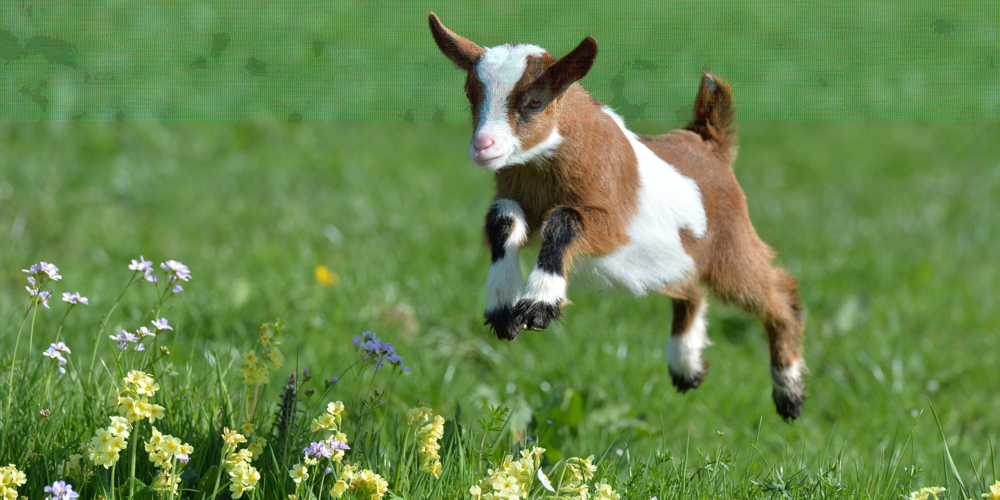
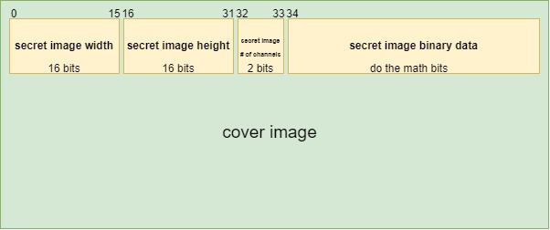
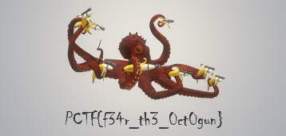

# 1337 Significant Bit

### Description
I've created a h4x0r method of least significant bit steganography. Instead of hiding bits in the LSB of each byte, I alternate between bits 1,3,3,7 (where 1 is the least significant bit, see mini diagram below). Basically, the 1st secret bit is encoded in the 1 bit of of the 1st cover byte, the 2nd secret bit is encoded in the 3 bit of the 2nd cover byte, the 3rd secret bit is encoded in the 3 bit of the 3rd cover byte, the 4th secret bit is encoded in the 7 bit of the 4th cover byte, and continue looping over 1,3,3,7 bit positions...

| 8 |  7 |  6 |  5 | 4 | 3 | 2 | 1 |
|---|----|----|----|---|---|---|---|
|128| 64 | 32 | 16 | 8 | 4 | 2 | 1 |

The data_structure.jpg image outlines the byte positions at which the secret image (and its width, height, and # of channels) is encoded into the cover image. Can you extract my secret image?

note: the width, height, and # of channels are also encoded with 1337 LSB

### Difficulty
Medium

### Flag
`PCTF{f34r_th3_0ct0gun}`

### Hints

### Author
Daniel Getter (NihilistPenguin)

### Tester
UnicodeSnowmanDev (Matthew Johnson) ✔️

### Writeup
There's really nothing to figure out, just a matter of writing up the script to do it.

Here's the encoded image: 

You can see all the changed bits at the top 4th of the image.

Here's the data structure:

So the image width is in the first 16 bytes, image height in the following 16, and then the # of channels in the following 2. Now we know our image size and can read the proper number of bits of encoded data.

You can write your own script or alter one of the many existing ones. I came across https://github.com/RobinDavid/LSB-Steganography, which I altered to do 1337 LSB. Note: that code is actually broken, I made a [pull request](https://github.com/RobinDavid/LSB-Steganography/pull/31) fixing the issues. So if you use [my repo](https://github.com/NihilistPenguin/LSB-Steganography), you should be able to use the base tool just fine.

[1337.py](1337.py) has my altered version of the base LSB code. The main changes are in `put_binary_value()` and `read_bit()` which use a counter and modulo 4 to determine which bit to extract. 

Here is the extracted image:

