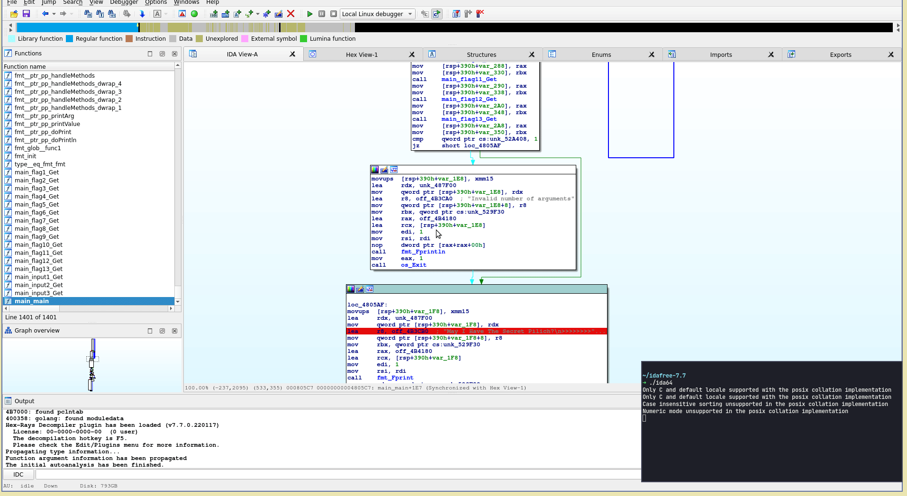

# GoObf

### Description

A very simple input validation.
Can you Go through the check and own the flag?

Flag Format: PCTF{}

### Difficulty 
4?

### Flag
PCTF{S1mpl3_GoL4ng_0bfusc4t10n}

### Hints
None

### Author
Biplav

### Tester
None yet

### Writeup
```
During build, each part of the flag was splitted onto multiple files 
and had a very simple obfuscation.

Later, all of them are combined together by calling them from main function.

The program checks for user input.
The correct input is "amazing" which is stored as a splitted string so that strings
command won't display whole string.

All letters are combined together during validation.

If it equals "amazing" then it prints out the flag.

Otherwise it shows error message.
```
Loading the binary in IDA, stepping through instructions, and at some point checking for value in RAX register shows the word "amazing".

### Solution:

