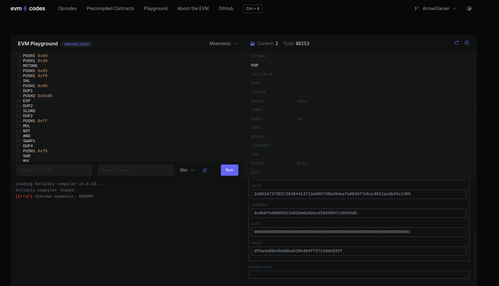

# SOLID_securITY

### Description

Recently I discovered this cool language where I can write some lines of code  
and it will let me transfer moniez.  
What's more amazing is that this cool tech also allows me to send data along with transactions.  
I love spending free moniez on testnet, so I sent some data, but I didn't know that the data is immutable.  
Although I'm pretty confident that I didn't spend much of my moniez, I might have sent important data which I can't erase now.  
If you'd like to find out what was it, you can do that easily by reversing those opcodes : ) 

Flag Format: PCTF{}


### We should only give the `opcodes` file.

### Difficulty 

6/10

### Flag

PCTF{Great_Job!!!_1337_U_Found_Hidd3n_Flag}

### Hints
Something that I will add later

### Author
Biplav

### Tester
None yet

### Writeup
```
The given file includes evm opcodes.  

I think the bytes in it can be extracted using panoramix decompiler in an easier way  
which I am still trying to find out.

But here is the way it can be solved.

That evm code can be ran inside evm playground in here  
https://www.evm.codes/playground

But the provided code won't run as it is,
All of the values that has PUSH opcode in them needs to have 0x appended for them  
to run inside that playground.

Also, some of the instructions towards end of the code need to be deleted as they  
are invalid opcodes.

Once, everything is fixed, one can step through couple hundred times and will have   
some value in the storage which is basically the result of XOR operation between certain bytes.    
  
Then, the values need to be decoded to make sense of what's in there.  
Each byte can be separated and reversed.  

There will a word "Address=" meaning that there will be the address for one of the  
smart contracts deployed.  

The address is "962a2F83dE2D71f34f499453Bad85De4984a9aDF"  

That address in GoerLi Ethereum Testnet is the address for a contract which has only one transaction.  

If we look at state of that contract, it can be seen that during contract deployment,  
another contract's address was passed which is "0x437c2fF46ebb4a20F8e2CE42c402108fDdeA695d".  

Seeing the UTF-8 decoded input data of the only transaction in there, gives us the flag.   
```
  
